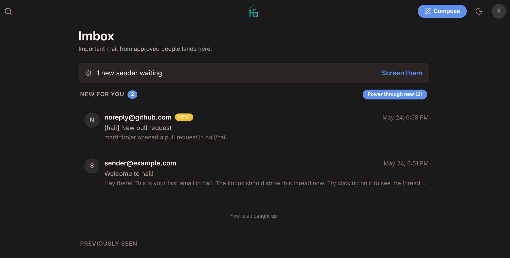

<p align="center">
  
</p>

<h1 align="center">hail</h1>

<p align="center">
  <strong>Rock-solid self-hosted email with a feature-rich client.</strong><br/>
  An opinionated webmail experience on top of your own mail server.
</p>

<p align="center">
  
</p>

---

## Why hail?

Modern email clients treat your inbox as an infinite stream. hail takes a different approach — an opinionated workflow that keeps you in control of what deserves your attention.

- **Your server, your data.** Runs on [Stalwart](https://stalw.art), a modern Rust JMAP mail server. No vendor lock-in.
- **The Screener.** New senders wait at the door. You decide who gets in — and where their mail goes.
- **Imbox, Feed, Paper Trail.** Three views, zero clutter. Important conversations in the Imbox. Newsletters in the Feed. Receipts and notifications in the Paper Trail.
- **Set Aside & Reply Later.** Pile up threads you'll get to later. They stay visible, not buried.
- **Bubble Up.** Schedule threads to resurface — later today, tomorrow, next week.
- **Power Through.** Triage new mail one thread at a time. Decide and move on.
- **Notes on threads.** Stick a note on any message. See it in the list, in the thread, in the composer.
- **Archive & Search.** Archive what you're done with. Full-text search across all views.
- **Keyboard-first.** Vim-style navigation throughout. `j`/`k`, `gg`/`G`, `d`, `e`, `y`, `m`, `.`, `?` — it all works.
- **Dark mode.** Warm dark palette with system detection or manual toggle.

## Architecture

```
┌───────────┐      ┌────────────┐      ┌───────────┐
│  Browser  │ ---> │  hail-api  │ ---> │ Stalwart  │
│ React SPA │      │ Rust/Axum  │      │   JMAP    │
└───────────┘      └─────┬──────┘      └───────────┘
                         │
                   ┌─────┴──────┐
                   │hail-worker │
                   │ Rust/tokio │
                   └─────┬──────┘
                         │
                   ┌─────┴──────┐
                   │  hail.db   │
                   │  SQLite    │
                   └────────────┘
```

- **hail-api** — Serves the React SPA, REST API, and WebSocket on a single port. No Node.js in production.
- **hail-worker** — Background worker for JMAP EventSource subscriptions, screener routing, send-later scheduling, bubble-up timers, and nightly reconciliation.
- **Stalwart** — Unmodified upstream mail server. hail talks to it via JMAP and the management API.
- **hail.db** — SQLite sidecar for hail-only state: screener rules, notes, piles, scheduled sends, bubble-ups.

## Quick start

```bash
# Clone
git clone https://github.com/your-org/hail.git
cd hail

# Start everything with Podman Compose
cp deploy/.env.example deploy/.env
# Edit deploy/.env with your domain and secrets
podman compose -f deploy/docker-compose.yml up -d

# Open the setup wizard
open http://localhost:8080
```

The setup wizard creates your first admin account and provisions your domain in Stalwart. After setup, log in and start using hail.

See [docs/quickstart.md](docs/quickstart.md) for the full guide including DNS, TLS, and Cloudflare Tunnel options.

## Documentation

| Doc | Description |
|-----|-------------|
| [quickstart.md](docs/quickstart.md) | Installation, configuration, first-run setup |
| [architecture.md](docs/architecture.md) | System map, hard decisions, rejected alternatives |
| [design.md](docs/design.md) | Product design and v1 feature spec |
| [roadmap.md](docs/roadmap.md) | Post-v1 backlog, release themes, TUI plans |
| [cloudflare-tunnel.md](docs/cloudflare-tunnel.md) | Cloudflare Tunnel + Email Routing recipes |
| [reverse-proxy.md](docs/reverse-proxy.md) | Nginx/Caddy reverse proxy setup |
| [backup.md](docs/backup.md) | Backup and restore procedures |
| [upgrade.md](docs/upgrade.md) | Upgrade guide between versions |
| [testing.md](docs/testing.md) | Test strategy and running tests |

## Features

### The Screener
New senders land here. Approve them into the Imbox, Feed, or Paper Trail — or deny them. Screened-out senders can be unblocked later.

### Imbox
Your important conversations. Sectioned into **Bubbled Up**, **New for you**, and **Previously Seen** (capped, so the Imbox stays finite). Hit **Power Through** to triage new mail one thread at a time.

### The Feed
Newsletters, notifications, and updates. Read them when you want, not when they arrive.

### Paper Trail
Receipts, confirmations, shipping updates. They're there when you need them.

### Set Aside & Reply Later
Drag threads into piles. Set Aside for "I'll deal with this." Reply Later for "I need to write back." They sit in the corner of every page as a gentle reminder.

### Bubble Up
Schedule a thread to resurface. "Later today," "tomorrow morning," "next week" — pick a time and forget about it until then.

### Compose
Markdown-friendly composer with autosave drafts, attachments, reply/reply-all/forward prefill, and send-later scheduling.

### Multiselect
Click sender avatars to select multiple threads. Batch archive, trash, set aside, or reclassify in one action.

### Keyboard shortcuts
Press `?` for the full list. Highlights:

| Key | Action |
|-----|--------|
| `j` / `k` | Navigate threads |
| `gg` / `G` | First / last thread |
| `o` / `Enter` | Open thread |
| `d` | Trash |
| `e` | Archive |
| `y` | Set aside |
| `r` / `a` / `f` | Reply / Reply all / Forward |
| `.` | Open action menu |
| `m` | Open main menu |
| `g i` | Go to Imbox |
| `c` | Compose |
| `/` | Search |
| `?` | Help |

## Tech stack

| Layer | Technology |
|-------|-----------|
| API server | Rust, Axum, SQLite (sqlx), utoipa |
| Background worker | Rust, tokio, JMAP EventSource |
| Mail server | Stalwart (JMAP + SMTP) |
| Frontend | React 19, Vite, TanStack Router & Query, Tailwind CSS v4 |
| Types | OpenAPI codegen (openapi-typescript) |
| Container | Multi-stage Dockerfile, Podman / Docker Compose |

## Development

```bash
# Rust — build and test
RUSTFLAGS="-D warnings" cargo build --workspace
RUSTFLAGS="-D warnings" cargo test --workspace

# Webapp — install, build, lint, test
cd webapp
npm install
npm run build
npm run lint
npm test

# Local development stack
podman compose -f deploy/docker-compose.local.yml up -d
```

## License

[MIT](LICENSE)

---

<p align="center">
  <em>Rock-solid email. Feature-rich client. Entirely yours.</em>
</p>
